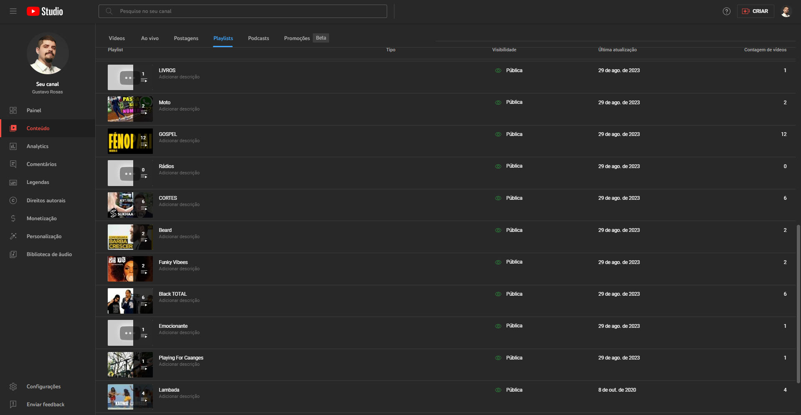

<div align="center">
   <a href="#caracteristicas">Características</a> •
   <a href="#status">Status</a> •
   <a href="#gif">GIF</a> •
   <a href="#capturas">Capturas de Tela</a> •
   <a href="#instalacao">Instalação e Uso</a> •
   <a href="#contribuicoes">Contribuições</a> 
</div>

# Playlist Privatizer

> Este repositório está atualmente disponibilizado de forma pública para fins de estudo. Sinta-se à vontade para fazer o download, criar sua cópia ou clonar o repositório para explorar o seu conteúdo.

Automatize o processo de tornar playlists públicas no YouTube em playlists privadas com o <b>Playlist Privatizer</b>. Um script simples, porém eficaz para alterar automaticamente a visibilidade das suas playlists.

## Características Principais <a id="caracteristicas"></a>

- **Automatização Simples:** O script realiza a sequência de instruções necessárias para tornar playlists públicas em privadas no YouTube.
- **Interface de Usuário Automatizada:** O script utiliza a biblioteca pyautogui para automatizar interações com o mouse e o teclado, permitindo a tomada de decisões com base em imagens.
- **Controle de Tolerância:** A biblioteca pyautogui permite ajustar a confiança na detecção de imagens para controlar a precisão do processo automatizado.

## Status do Projeto <a id="status"></a>

O <b>Playlist Privatizer</b> está finalizado.

### GIF Demonstrativo <a id="gif"></a>


### Capturas de Tela <a id="capturas"></a>

##### ❇ O problema

| Diversas playlists públicas                             |
|---------------------------------------------------------|
|  |


## Instalação e Uso<a id="instalacao"></a>

Para utilizar o <b>Playlist Privatizer</b>, certifique-se de que você tenha o Python 3.11.3 ou superior instalado em sua máquina. Em seguida, siga as instruções abaixo:

1. Clone este repositório:
   ```
   git clone https://github.com/GustavoRosas-Dev/playlist-privatizer.git
   ```
2. Navegue até o diretório do projeto:
   ```
   cd playlist-privatizer
   ```
3. Instale as dependências:
   ```
   pip install -r requeriments.txt
   ```

4. Execute o software:
   ```
   python main.py
   ```

5. O script automatizará o processo de transformar playlists públicas em privadas no YouTube.

---

**Observações Adicionais:**

- Ative o **modo escuro** no YouTube.
- Após iniciar o software, posicione o mouse na página do YouTube, conforme mostrado no tópico <a href="#gif">GIF Demonstrativo</a>

## Contribuições <a id="contribuicoes"></a>

Contribuições são bem-vindas! Se você deseja contribuir para o aprimoramento do <b>Playlist Privatizer</b>, siga estas etapas:

1. Faça um fork deste repositório.
2. Crie um novo branch para a sua funcionalidade:
   ```
   git checkout -b feature/nova-funcionalidade
   ```
3. Faça as alterações necessárias e teste-as.
4. Faça o commit das suas alterações:
   ```
   git commit -m "Adicionada nova funcionalidade"
   ```
5. Envie para o seu repositório fork:
   ```
   git push origin feature/nova-funcionalidade
   ```
6. Abra um `Pull Request` no repositório original.

## Licença

Este projeto é distribuído sob a Licença MIT. Consulte o arquivo `LICENSE` para obter mais detalhes.

## Nota

O **Playlist Privatizer** é uma ferramenta útil para automatizar o processo de tornar playlists públicas no YouTube em playlists privadas.

---

Feito com um gole de ☕ por [Gustavo Rosas](https://github.com/GustavoRosas-Dev).
